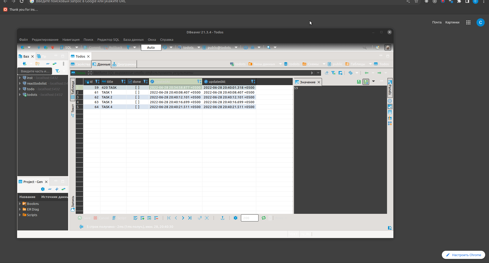

# ToDo
## Nest.js + PostgreSQL + React.js + TypeScript and some animation

### Please check how to launch the application below:

Client

    npm install;
    Launch frontend server with npm start;

Server

    npm install;
    Create file .env according to envsimple.txt
    Create DB;
    Launch backend server with npm start;

